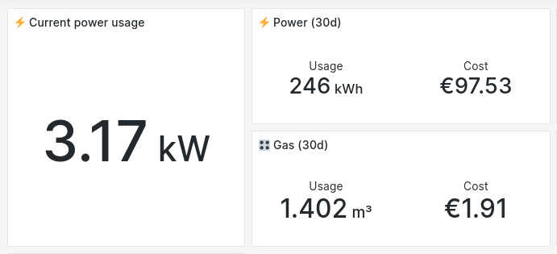

# go-dsmr [](https://github.com/alexbakker/go-dsmr/actions/workflows/build.yml)

__go-dsmr__ is a Go package for reading
[DSMR](https://www.netbeheernederland.nl/_upload/Files/Slimme_meter_15_a727fce1f1.pdf)
telegrams of Dutch smart meters. There's also a [Prometheus
exporter](cmd/dsmr-exporter) that reads from the serial P1 port and exports the
data as metrics.

It currently supports a limited set of metrics exposed by the Kaifa MA304.

## Prometheus metrics

The set of metrics that the Prometheus exporter exports varies depending on the
smart meter model that you have and its configuration. Other factors: connection
to a gas meter, the amount of phases your electrical connection has, etc. Here's
an example of the metrics that'll be exported for a Kaifa MA304:

```
dsmr_connection_info{protocol_header="KFM5KAIFA-METER",protocol_version="50",serial_device="/dev/serial/by-id/usb-FTDI_FT232R_USB_UART_XXXXXXXX-if00-port0"} 1
dsmr_electricity_phase_current_a{phase="l1"} 0 1695550012000
dsmr_electricity_phase_current_a{phase="l2"} 1 1695550012000
dsmr_electricity_phase_current_a{phase="l3"} 0 1695550012000
dsmr_electricity_phase_power_delivered_kw{phase="l1"} 0.029 1695550012000
dsmr_electricity_phase_power_delivered_kw{phase="l2"} 0.34 1695550012000
dsmr_electricity_phase_power_delivered_kw{phase="l3"} 0 1695550012000
dsmr_electricity_phase_power_received_kw{phase="l1"} 0 1695550012000
dsmr_electricity_phase_power_received_kw{phase="l2"} 0 1695550012000
dsmr_electricity_phase_power_received_kw{phase="l3"} 0 1695550012000
dsmr_electricity_phase_voltage_v{phase="l1"} 236.6 1695550012000
dsmr_electricity_phase_voltage_v{phase="l2"} 237.6 1695550012000
dsmr_electricity_phase_voltage_v{phase="l3"} 237.3 1695550012000
dsmr_electricity_power_delivered_kw 0.37 1695550012000
dsmr_electricity_power_delivered_kwh_total{tarrif="low"} 405.405 1695550012000
dsmr_electricity_power_delivered_kwh_total{tarrif="normal"} 479.259 1695550012000
dsmr_electricity_power_received_kw 0 1695550012000
dsmr_gas_delivered_m3 4.59 1695549909000
```



## NixOS

This repository comes with a NixOS module for the DSMR Prometheus exporter. To
use it, simply add this repository as an input to your Nix flake and import the
module into your NixOS configuration.

Example usage:

```nix
{
  services.dsmr-exporter = {
    enable = true;
    port = 9111;
    serialDevice = "/dev/serial/by-id/usb-FTDI_FT232R_USB_UART_XXXXXXXX-if00-port0";
  };
}
```
